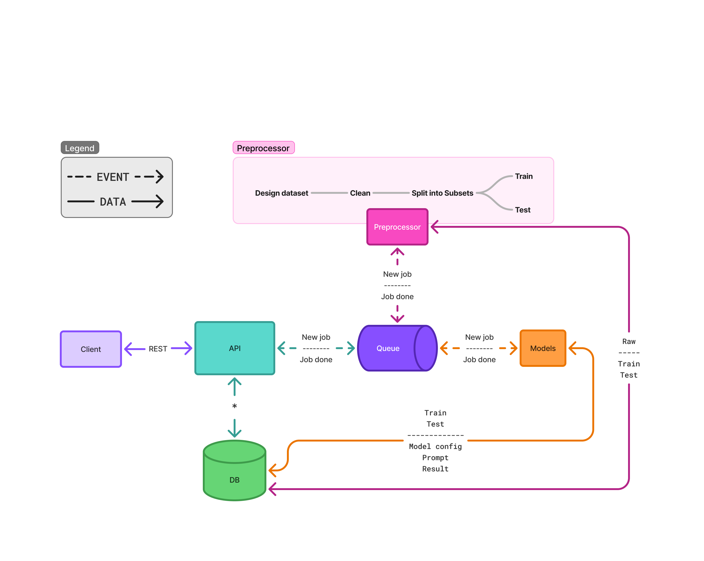
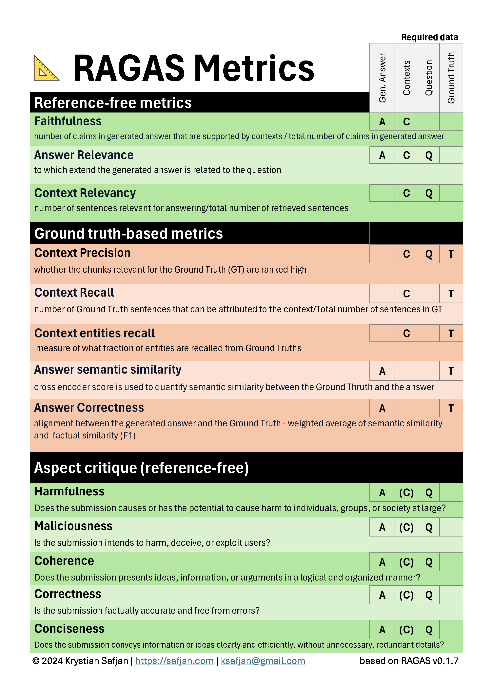
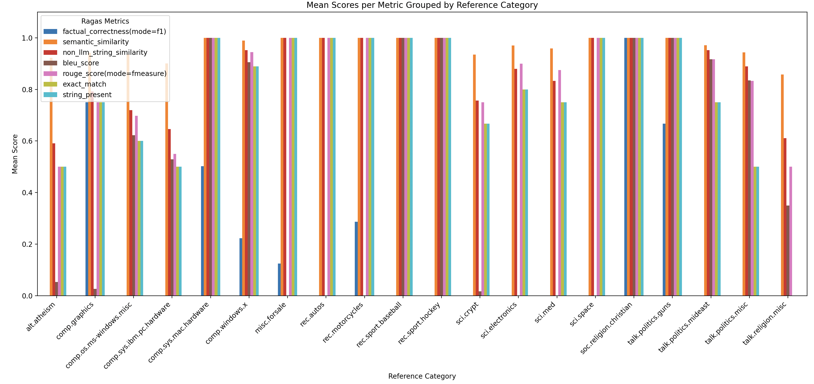
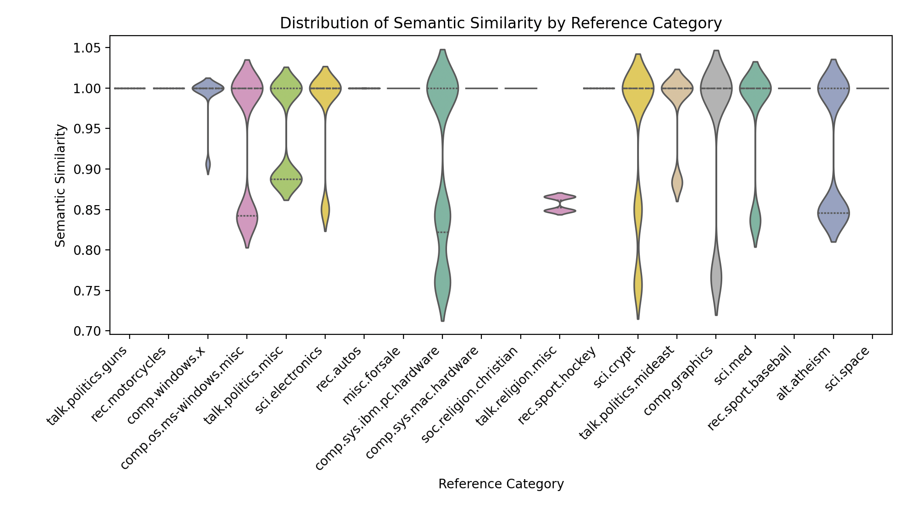
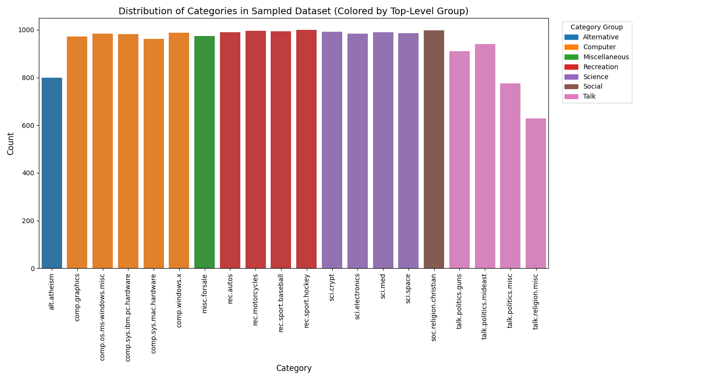

# Sputnik

The text classifier

## Imaginary architecture

> [!NOTE]
> The architecture is imaginary and does not represent the actual architecture of the system.

## Experiment flow

## Ragas metrics

## Bar

## Viol

## Sampled dataset &mdash; category distribution

## Combined confusion matrix over 10 folds &mdash; SVM

